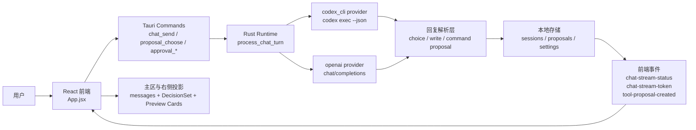
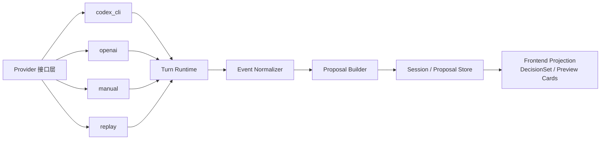
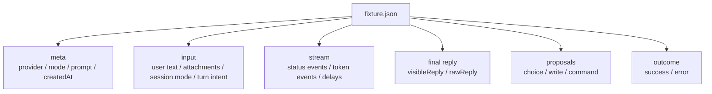
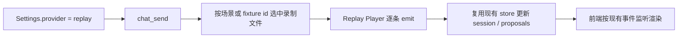

# Solo Replay Provider 架构图

最后更新：2026-03-30

## 目标

给 `Solo` 增加一个开发专用的 `replay provider`：

- 数据来源是真实 `codex_cli` 跑出来的事件和结果
- 日常测试时不再每轮 live 调 `codex exec`
- 前端仍然收到和真实链路一致的事件序列
- 不把录制/回放逻辑揉进主业务状态机

这份图分两部分：

- 当前运行链路
- 建议中的 `replay provider` 链路

## 当前链路

## 当前问题

- `codex_cli` 是重链路：冷启动、建上下文、扫工作区、等 JSON 事件流，日常 UI 测试太慢。
- `manual` 虽然快，但不是 live 数据。
- 现在缺一条“真实数据但不必每次 live 重跑”的测试通道。

## 建议架构

```mermaid
flowchart TD
    subgraph Live["真实录制阶段"]
        U1["用户"]
        FE1["前端发送请求"]
        CMD1["chat_send"]
        RT1["Runtime"]
        COD1["codex_cli"]
        EV1["标准化事件流\nstatus / token / proposal / final reply"]
        REC["Replay Recorder\n开发态录制器"]
        FX["Fixture 文件\nJSON"]

        U1 --> FE1 --> CMD1 --> RT1 --> COD1 --> EV1
        EV1 --> REC --> FX
        EV1 --> FE1
    end

    subgraph Replay["快速回放阶段"]
        U2["用户"]
        FE2["前端发送请求"]
        CMD2["chat_send"]
        RT2["Runtime"]
        RP["replay provider"]
        LOAD["Fixture Loader"]
        PLAYER["Replay Player\n按时间轴 emit 事件"]
        EV2["标准化事件流\nstatus / token / proposal / final reply"]
        FEV["前端现有监听器"]

        U2 --> FE2 --> CMD2 --> RT2 --> RP --> LOAD --> PLAYER --> EV2 --> FEV
    end
```

## 设计原则

- `replay provider` 只是 provider adapter，不是新的主状态模型。
- 回放层只负责重放“标准化后的事件”，不关心主区怎么排版。
- `sessions / proposals / DecisionSet` 继续复用现有逻辑，不单独造第二套 UI 数据源。
- 录制结果优先保存“Solo 已经理解过的事件”，而不是原始 `codex --json` 噪声。

## 建议分层

## Replay Fixture 建议结构

建议先只录这些，不先录更多：

- `chat-stream-status`
- `chat-stream-token`
- 最终 assistant reply
- proposal 列表
- 本轮成功/失败结果

## 运行方式

## 我刻意不做的事

- 不把 `replay` 混进 `DecisionSet` 投影层。
- 不引入新的“测试专用消息格式”。
- 不先重构成 `turn/item` 才做回放。
- 不让前端知道它收到的是 live 还是 replay，尽量保持同一事件协议。

## 这版最重要的 review 点

- `replay provider` 应不应该只重放“标准化事件”，还是要保留原始 `codex --json` 供调试。
- fixture 应该按“场景名”选取，还是按“当前输入 hash”自动匹配。
- 录制入口是放在开发菜单、设置页，还是单独 CLI 脚本。
- 回放速度要不要支持 `1x / 4x / instant`。

## 我当前的结论

第一版最稳的切法是：

- 保持现有 `provider -> runtime -> normalizer -> proposals -> UI` 链路不变
- 新增 `replay provider`
- 让它直接喂“标准化事件 + 最终 reply + proposals”

这样改动面最小，测试收益最大，也最符合 `Solo` 现在“先把视觉化决策流打磨顺”的阶段目标。
