# Solo 架构图总览

最后更新：2026-03-30

适用范围：

- 这份文档描述的是当前仓库实现出来的 `Solo`
- 图里会明确区分：
  - 当前已实现结构
  - 已经在代码里出现的过渡结构
  - 后续建议目标

相关文件：

- 产品与 runtime 重心：[solo-control-plane.md](./solo-control-plane.md)
- 主界面设计：[solo-surface-design.md](./solo-surface-design.md)
- 前端：[App.jsx](/home/chikee/workspace/solo/src/App.jsx)
- IPC 入口：[desktop.js](/home/chikee/workspace/solo/src/api/desktop.js)
- Tauri runtime：[lib.rs](/home/chikee/workspace/solo/src-tauri/src/lib.rs)
- 数据模型：[models.rs](/home/chikee/workspace/solo/src-tauri/src/models.rs)
- 持久化与工作区：[storage.rs](/home/chikee/workspace/solo/src-tauri/src/storage.rs)
- OpenAI 通道：[openai.rs](/home/chikee/workspace/solo/src-tauri/src/openai.rs)

## 1. 系统上下文

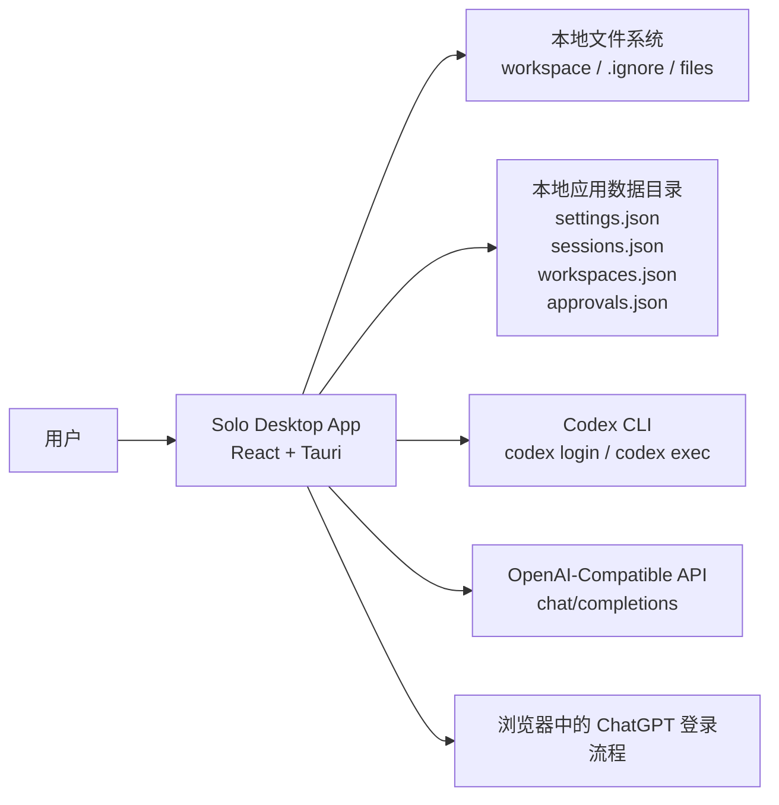

当前判断：

- `Solo` 是本地桌面工作台，不是浏览器 SaaS。
- 工作区、会话、审批、预览都以本地状态为主。
- `codex_cli` 和 `openai` 都只是接入通道，不应定义产品主语义。

## 2. 代码模块总览

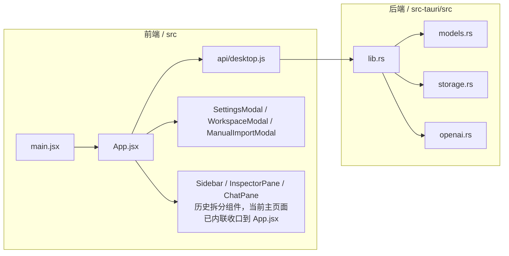

当前结构特征：

- 前端状态机高度集中在 [App.jsx](/home/chikee/workspace/solo/src/App.jsx)。
- Rust 端也高度集中在 [lib.rs](/home/chikee/workspace/solo/src-tauri/src/lib.rs)。
- 模块边界已经有雏形，但还没进一步拆成更清晰的 service/runtime layer。

## 3. 前端架构

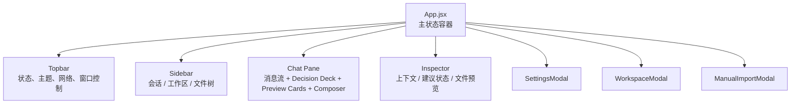

说明：

- 当前主页面已经不是“多个大组件各自持有复杂状态”，而是 `App.jsx` 统一持状态，再把局部 UI 作为片段或轻组件渲染。
- 这是当前实现最真实的前端架构，不是理想化分层。

## 4. 前端状态与派生关系

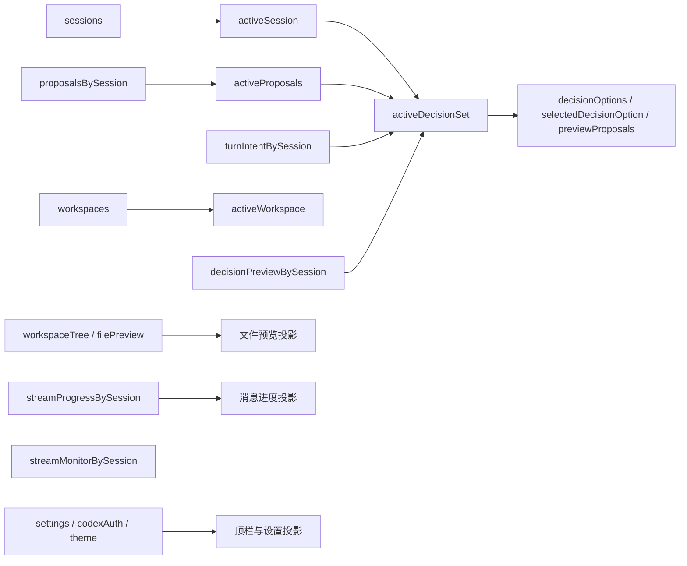

核心点：

- 当前前端的“领域投影”主要体现在 `DecisionSet`。
- `DecisionSet` 不是后端真模型，而是前端从 `proposal` 集合投影出来的过渡层。
- 这也是当前最明显的过渡性：产品已经开始按决策域表达，底层仍是 `messages + proposals`。

## 5. 前端事件监听架构

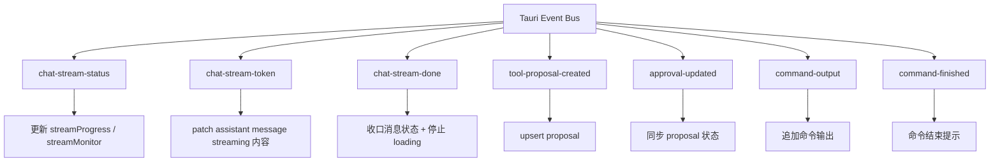

这个事件层很关键：

- 前端不是被动等一个最终回复对象。
- 它在消费一条运行时事件流。
- 这也是后续做 `replay provider`、`turn/item` 的最好切入点。

## 6. IPC / Tauri Commands 边界

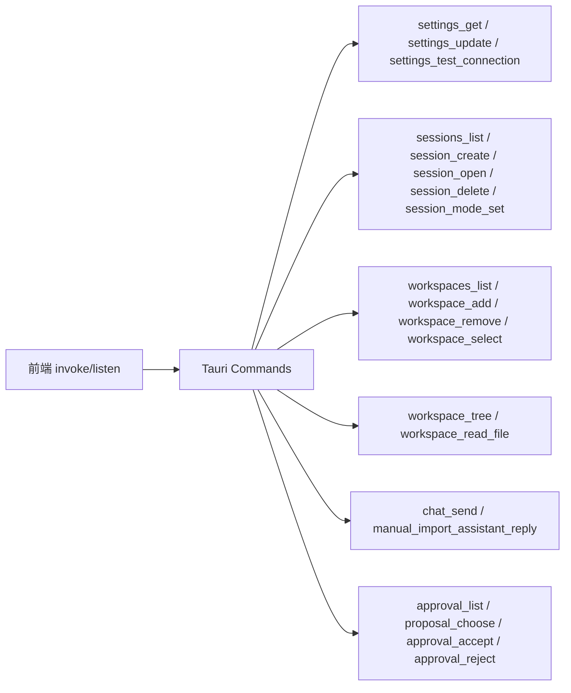

这层职责很清楚：

- 前端只能通过 command 访问系统能力。
- 读写工作区、跑命令、登录检测、模型请求都不直接暴露给前端。

## 7. 会话与回合执行主流程

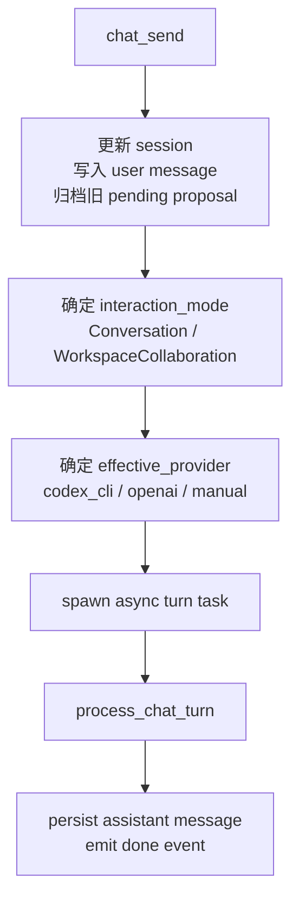

这个流程的几个关键现实：

- `chat_send` 先写本地 session，再异步跑模型。
- `manual` provider 在 `chat_send` 后就直接返回，不会自动跑模型。
- `openai` provider 会在有本机 Codex 登录态时被折返为 `codex_cli`。

## 8. Provider 架构

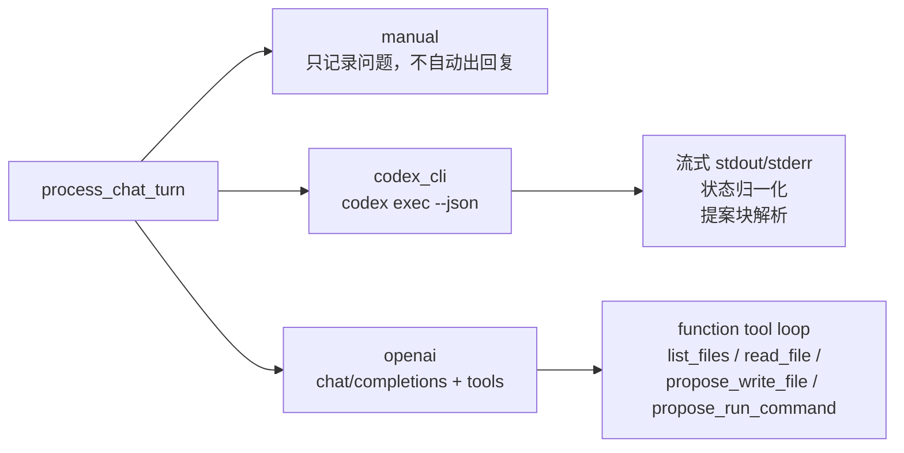

当前 provider 差异：

- `manual`：最轻，只记消息，回复由用户手动导入。
- `codex_cli`：最重，但最贴近当前工作区协作产品体验。
- `openai`：真实 API 通道，但当前更像兼容入口，不是主路线。

## 9. Codex CLI 流式执行链路

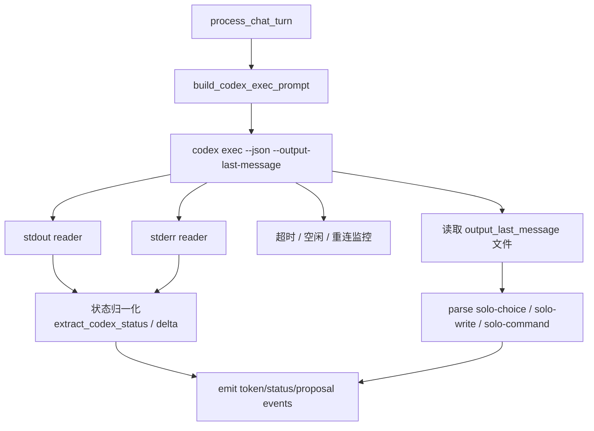

这里体现了当前 `Solo` 的一个重要现实：

- `codex_cli` 不是简单“拿一段最终文本”。
- 它已经被包装成一条带进度、提案解析、重连监控的 runtime adapter。

## 10. OpenAI Provider 工具调用链路

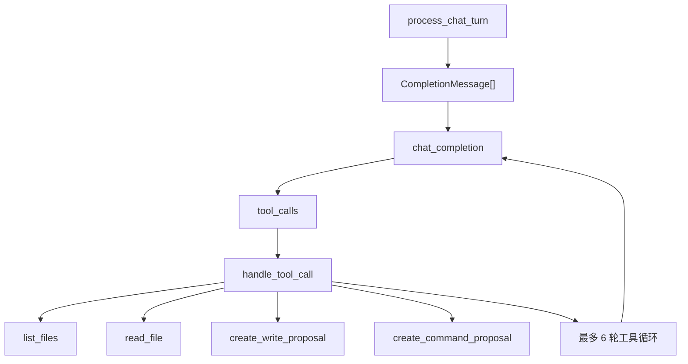

说明：

- `openai` 这条链不解析 `solo-*` 代码块。
- 它走的是 function tools。
- 所以当前两个 provider 的“提案生成协议”其实是不一致的。

这也是后续需要继续收敛 runtime 协议的原因。

## 11. Proposal / Approval 领域流

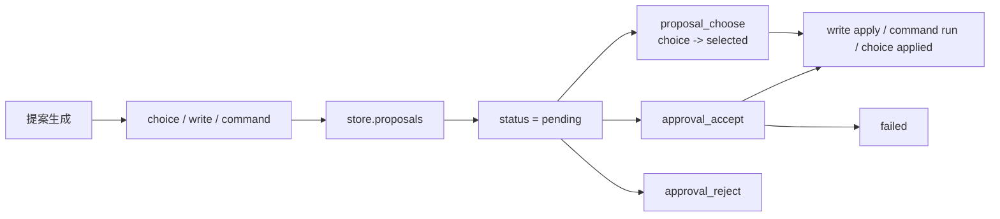

当前状态机并不完全统一：

- `choice`：`pending -> selected -> 后续一轮 preview`
- `write`：`pending -> applied`
- `command`：`pending -> approved -> applied/failed`

所以它已经有审批语义，但还不是一套整齐的 turn/item 状态机。

## 12. 决策流投影架构

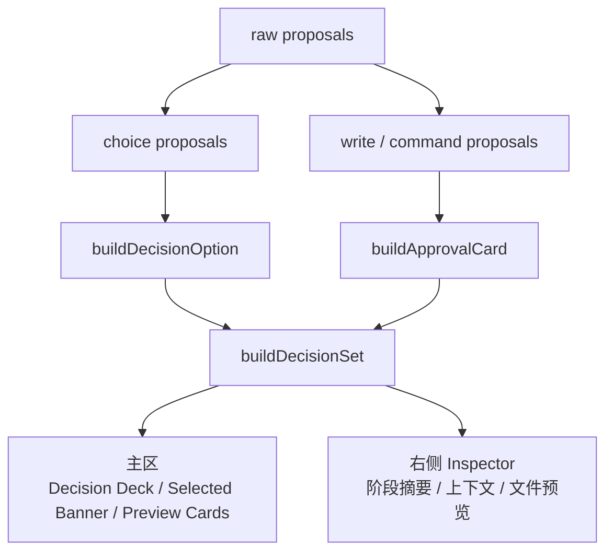

这张图代表当前最重要的产品表达：

- 原始 `proposal` 不再直接等于主区 UI。
- 主区主要读 `DecisionSet` 投影。
- 右侧已经降级为上下文和状态摘要，不再承担主决策面。

## 13. 工作区与文件系统架构

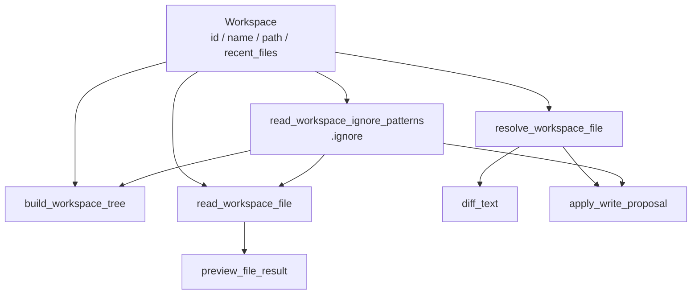

这里的边界是清楚的：

- `.ignore` 已经不只是 UI 过滤，而是进入读取和写入链路。
- 写文件不是直接执行，而是先生成带 `base_hash` 的 proposal，再应用。

## 14. 本地持久化架构

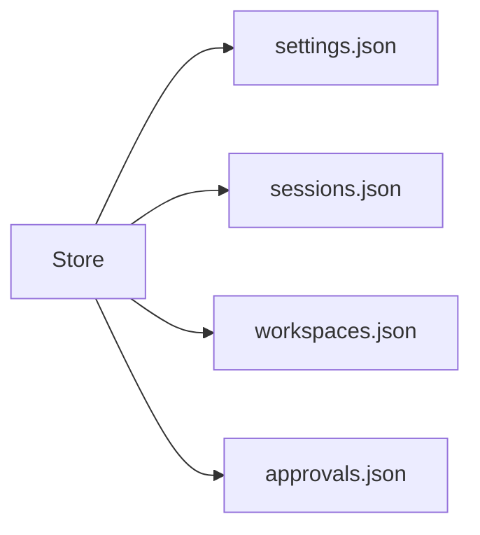

当前事实：

- 本地真相是四个 JSON 文件。
- 没有数据库。
- `Store` 通过 `Mutex` 串行访问。

优点是简单，缺点是：

- 状态模型现在还比较扁平。
- 一旦 turn/item 真正落地，持久化结构大概率也要升级。

## 15. 命令执行链路

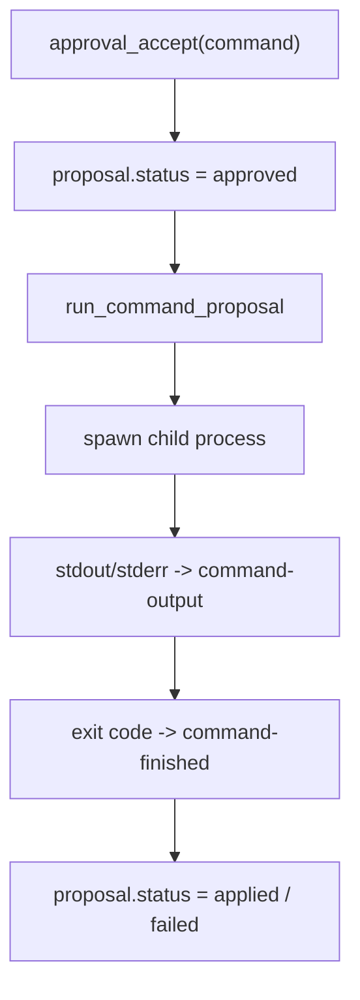

特点：

- 命令 proposal 不会在确认前执行。
- 命令输出是单独事件流，不复用聊天 token 流。

## 16. 手动导入链路

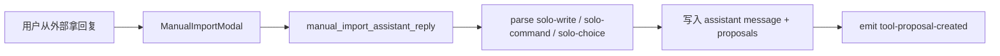

这条链路的价值不是“假数据”，而是：

- 它已经证明 `Solo` 可以把“回复来源”和“前端体验”解耦。
- 后续无论做 `replay provider` 还是更多 provider，都会复用这类解耦思路。

## 17. 当前真实架构边界

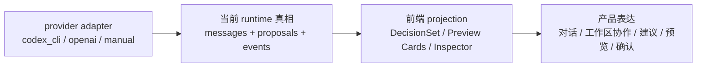

当前最重要的判断：

- `UI` 已经开始按产品语义组织。
- `PROJECTION` 已经出现。
- 真正还没升级的是 `RUNTIME`，它还没有正式收敛为 `session -> turn -> item`。

## 18. 目标架构

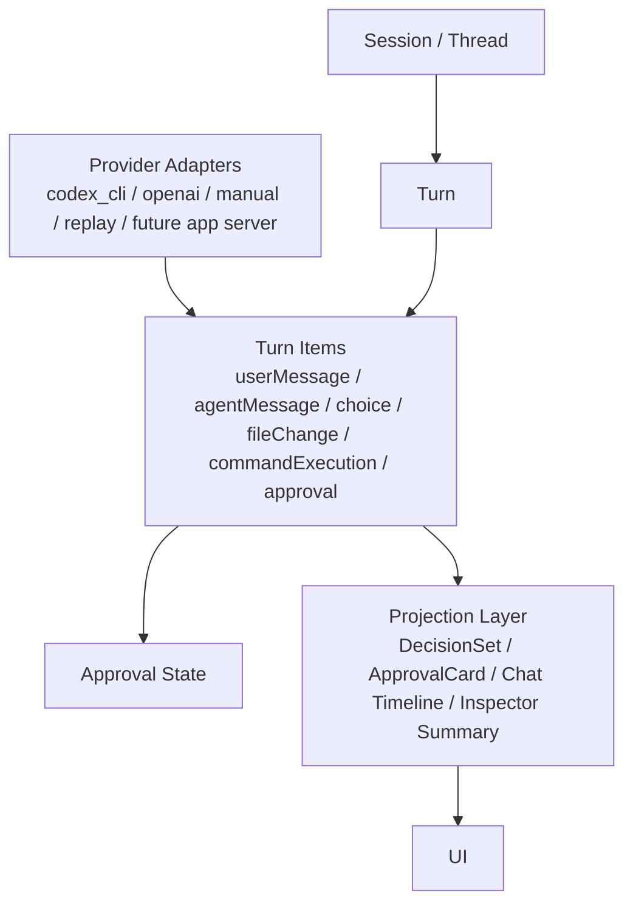

这不是“已经实现”的图，而是现在最合理的收敛目标。

和当前实现相比，差别在于：

- 当前：`messages + proposals` 还是底层真相
- 目标：`turn + item + approval` 才是底层真相
- 当前：DecisionSet 是前端投影
- 目标：DecisionSet 应该从统一 item/projection 层投出来

## 19. Replay Provider 在全局架构中的位置

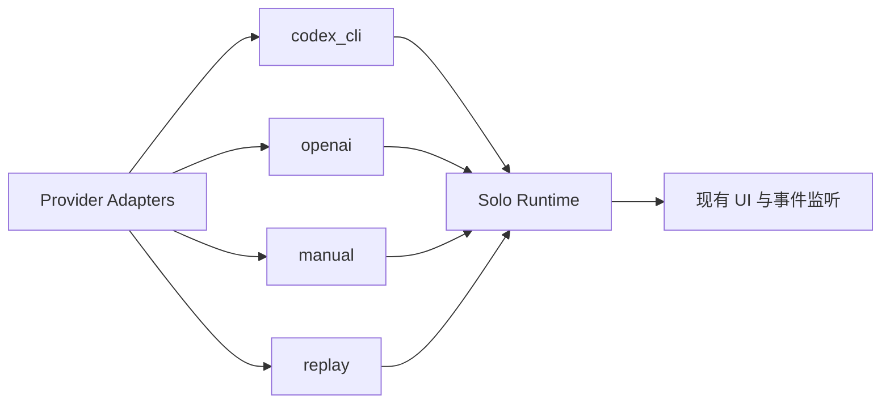

这块是补充说明：

- `replay` 应该只是 provider adapter，不应该自带第二套 UI。
- 它应该复用现有事件协议和 proposal/store 更新路径。

更细的 `replay` 设计见 [replay-provider-architecture.md](/home/chikee/workspace/solo/docs/replay-provider-architecture.md)。

## 20. 我对当前架构的直接结论

### 做对了的部分

- 产品模式已经明确：`对话 / 工作区协作` 是显式状态。
- 主区已经开始从“长消息”转向“决策流”。
- `.ignore` 已经进入真实协作边界，而不只是 UI 装饰。
- provider、存储、文件系统、事件流已经有初步边界。

### 当前最大的问题

- 前端和 Rust 端的主状态机都还过于集中在单文件。
- `codex_cli` 和 `openai` 的提案协议还不统一。
- `messages + proposals` 仍是底层真相，DecisionSet 还只是投影层补救。
- 审批流已经有了，但还不是统一 item 状态机。

### 最值得继续推进的方向

1. 继续把 `DecisionSet` 从前端投影推进到更稳定的 runtime projection。
2. 让 provider 输出统一进入一套 item/projection 协议，而不是各走各的解析方式。
3. 把 `App.jsx` 和 `lib.rs` 继续拆薄，但前提是先明确 runtime 边界，不是机械拆文件。
